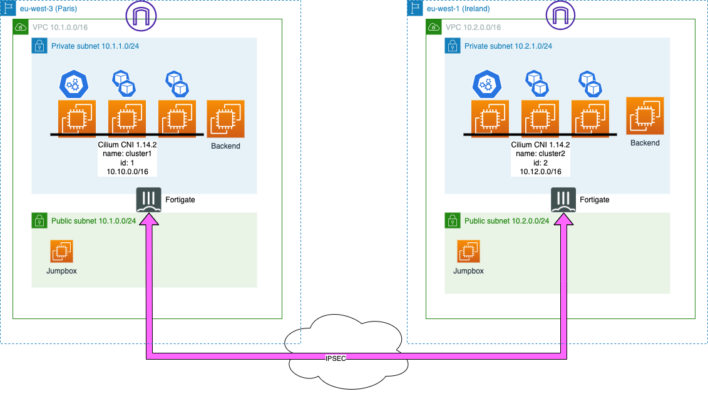
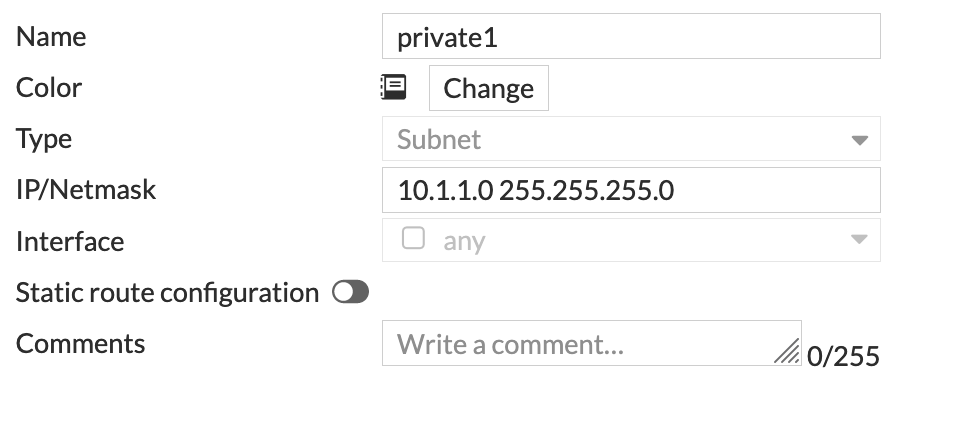
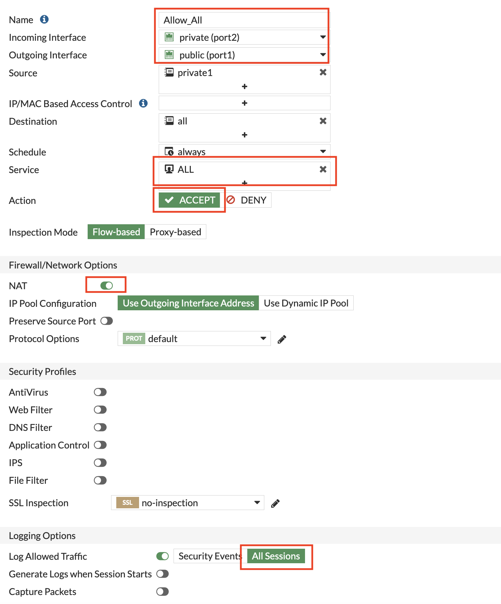
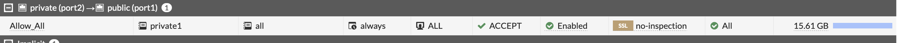
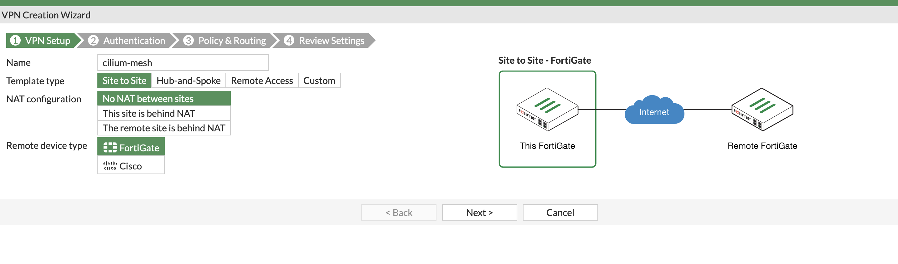
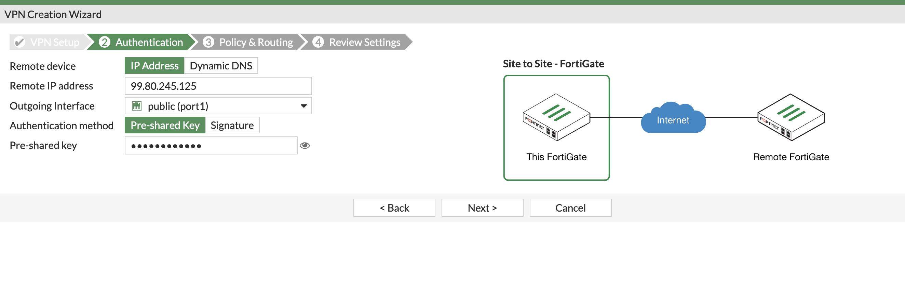
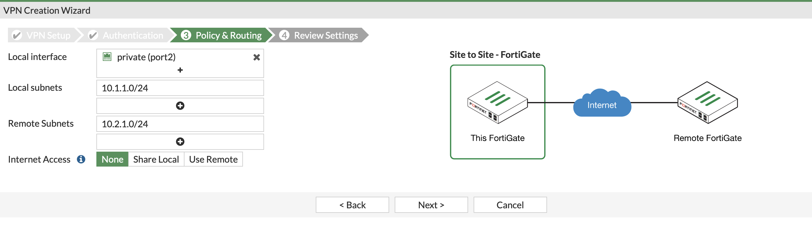
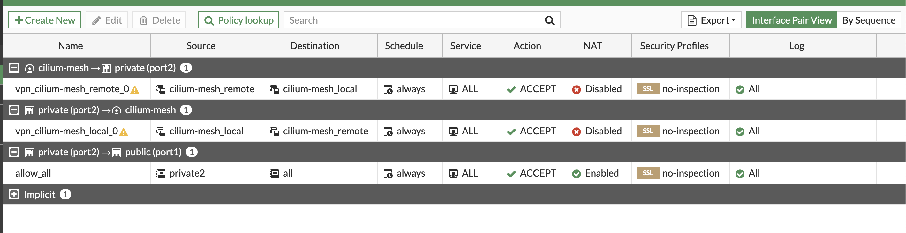
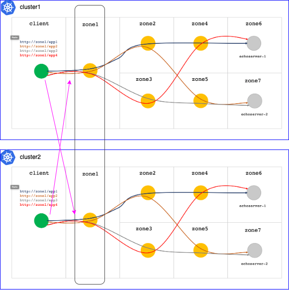

# Cilium Clustermesh multi-region using Fortinet Fortigate VPN in AWS
## Introduction
<p align="center">

</p> <br>

## Setting up the network and fortigate infrastructure
Next terraform plan will create a public and private network and deploy a PAYG fortigate instance.<br>
Rename `terraform.tfvars.example` to `terraform.tfvars` and populate the variables. <br>
Deployment will happen in AWS region `eu-west-3`.
```
cd fgtsingle1
terraform init
terraform apply 
```
Repeat the process for AWS region `eu-west-1` (fgtsingle2)<br>
Give it some minutes. The `terraform output` will provide login details and IP address of the Fortigates.

## Configuring the Fortigates
### Create an allow_all outbound rule
<details>
<summary>Create on both firewall an address resource representing the private networks.</summary>
- eu-west-3 (fgtsingle1) -> 10.1.1.0/24<br>
- eu-west-1 (fgtsingle2) -> 10.2.1.0/24<br>
<br>
<br>
<p align="center">

</p> <br>
</details>
<details>
  <summary>Create an outbound firewall rule.</summary>
<p align="center">
<br><br>

</p> <br>
</details>

### Create a VPN IPSEC tunnel
<details>
<summary>IPSEC VPN setup using VPN wizard</summary>

<p align="center">
<br>
<br>
<br>
<br>
</p> <br>
</details>

## Deploying kubernetes and jumpbox
In the next step, a 3-node kubernetes cluster is deployed, together with a jumpbox and backend test server.<br>
Rename terraform.tfvars.example to terraform.tfvars and populate the variables.<br>
The information can be obtained from the `terraform output` for both fortigate deployments.
```
cd terraform-k8s-1
terraform init
terraform apply
```
Repeat process for terraform-k8s-2

## Deploying the clustermesh
### Install pre-requisite tooling
On both clusters:
```
CILIUM_CLI_VERSION=$(curl -s https://raw.githubusercontent.com/cilium/cilium-cli/main/stable.txt)
CLI_ARCH=amd64
if [ "$(uname -m)" = "aarch64" ]; then CLI_ARCH=arm64; fi
curl -L --fail --remote-name-all https://github.com/cilium/cilium-cli/releases/download/${CILIUM_CLI_VERSION}/cilium-linux-${CLI_ARCH}.tar.gz{,.sha256sum}
sha256sum --check cilium-linux-${CLI_ARCH}.tar.gz.sha256sum
sudo tar xzvfC cilium-linux-${CLI_ARCH}.tar.gz /usr/local/bin
rm cilium-linux-${CLI_ARCH}.tar.gz{,.sha256sum}


export HUBBLE_VERSION=$(curl -s https://raw.githubusercontent.com/cilium/hubble/master/stable.txt)
curl -L --remote-name-all https://github.com/cilium/hubble/releases/download/$HUBBLE_VERSION/hubble-linux-amd64.tar.gz{,.sha256sum}
sha256sum --check hubble-linux-amd64.tar.gz.sha256sum
sudo tar xzvfC hubble-linux-amd64.tar.gz /usr/local/bin
rm hubble-linux-amd64.tar.gz{,.sha256sum}

sudo snap install helm --classic
helm repo add cilium https://helm.cilium.io/
```
### Install Cilium CNI on cluster1
```
helm install cilium cilium/cilium --version 1.14.2 \
    --namespace kube-system \
    --set authentication.mutual.spire.enabled=true \
    --set authentication.mutual.spire.install.enabled=true \
    --set hubble.relay.enabled=true \
    --set hubble.ui.enabled=true \
    --set encryption.enabled=true \
    --set encryption.type=wireguard \
    --set kube-proxy-replacement=strict \
    --set ingressController.enabled=partial \
    --set ingressController.loadbalancerMode=shared \
    --set ingressController.service.type="NodePort" \
    --set loadBalancer.l7.backend=envoy \
    --set auto-create-cilium-node-resource=true \
    --set ipam.operator.clusterPoolIPv4PodCIDRList="10.10.0.0/16" \
    --set ipam.operator.clusterPoolIPv4MaskSize="24" \
    --set ipam.mode=cluster-pool \
    --set cluster.id=1 \
    --set cluster.name="cluster1"
```
### Install Cilium CNI on cluster2
```
helm install cilium cilium/cilium --version 1.14.2 \
    --namespace kube-system \
    --set authentication.mutual.spire.enabled=true \
    --set authentication.mutual.spire.install.enabled=true \
    --set hubble.relay.enabled=true \
    --set hubble.ui.enabled=true \
    --set encryption.enabled=true \
    --set encryption.type=wireguard \
    --set kube-proxy-replacement=strict \
    --set ingressController.enabled=partial \
    --set ingressController.loadbalancerMode=shared \
    --set ingressController.service.type="NodePort" \
    --set loadBalancer.l7.backend=envoy \
    --set auto-create-cilium-node-resource=true \
    --set ipam.operator.clusterPoolIPv4PodCIDRList="10.12.0.0/16" \
    --set ipam.operator.clusterPoolIPv4MaskSize="24" \
    --set ipam.mode=cluster-pool \
    --set cluster.id=2 \
    --set cluster.name="cluster2"
```
### Enable the clustermesh service
On both clusters:
```
cilium clustermesh enable --service-type NodePort
```
### Rename the context 
On cluster1:
```
kubectl config rename-context kubernetes-admin@kubernetes kubernetes-admin@kubernetes1
```
On cluster2:
```
kubectl config rename-context kubernetes-admin@kubernetes kubernetes-admin@kubernetes2
```
### Create a kubeconfig with access to both clusters
Combine both `.kube/config` files
- make sure clusternames are different
- make sure usernames are differemt
- make sure context names are different
```
export KUBECONFIG-$PWD/kubeconfig.yaml
```
```
~$ kubectl config get-contexts
CURRENT   NAME                           CLUSTER       AUTHINFO            NAMESPACE
*         kubernetes-admin@kubernetes1   kubernetes1   kubernetes-admin1
          kubernetes-admin@kubernetes2   kubernetes2   kubernetes-admin2
```
### Connect both clusters
```
cilium clustermesh connect --context kubernetes-admin@kubernetes1 --destination-context kubernetes-admin@kubernetes2
```
### Deploy demo app
```
git clone https://github.com/xxradar/app_routable_demo.git
cd ./app_routable_demo
./setup.sh
watch kubectl get po -n app-routable-demo -o wide
```
## Testing the clustermesh

<p align="center">

</p>
<br>

Annotate a service (zone1)
```
  annotations:
    service.cilium.io/global: "true"
    service.cilium.io/shared: "true"
```
You can test this:
```
kubectl run -it -n app-routable-demo --rm --image xxradar/hackon mycurler -- bash
       curl -v -H "Cookie: loc=client" http://zone1/app3
```
Annotate a service (zone1)
```
  annotations:
    service.cilium.io/global: "true"
    service.cilium.io/shared: "false"
```
You can test this:
```
kubectl run -it -n app-routable-demo --rm --image xxradar/hackon mycurler -- bash
       curl -v -H "Cookie: loc=client" http://zone1/app3
```

